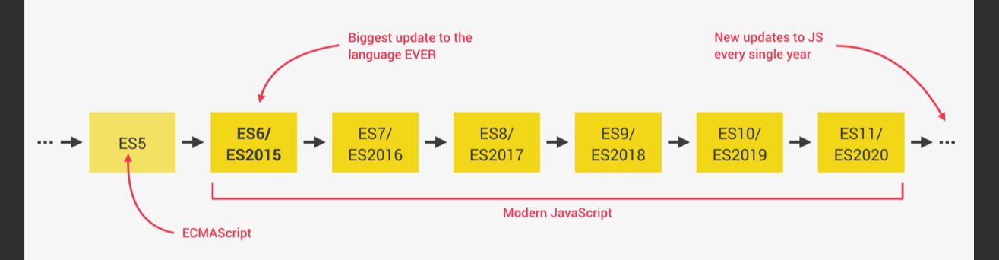
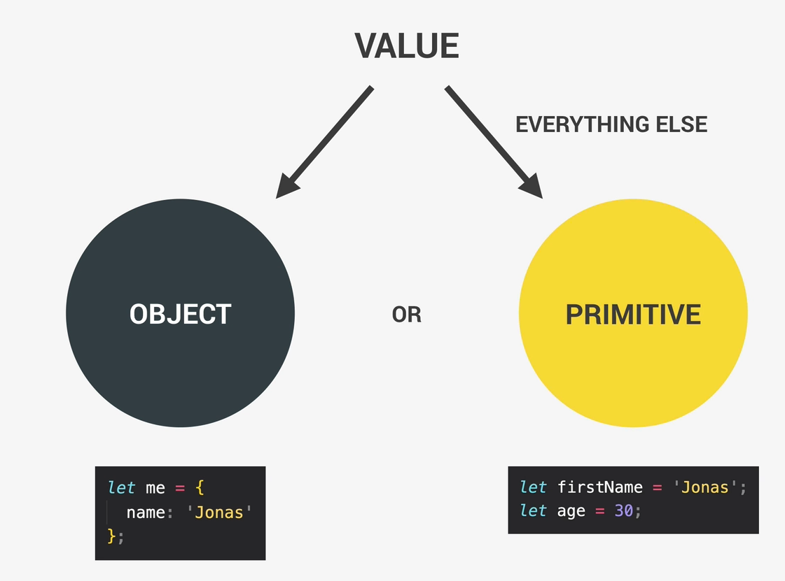
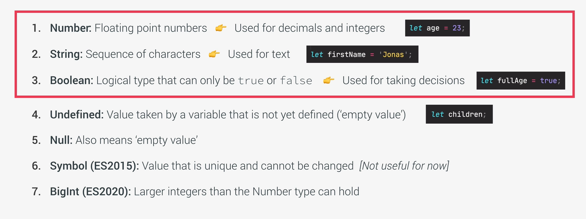

+ **javascript** is a high level, objct-oriented, multi-praradigm programming languges
  + high level: we dont need to worry about complex stuff like memory management
  + object-oriented: based on objectsfor storing most kinds of data
  + programing language: needs a computer to do things
  + multi-paradigm: we can use different styles of programming

#### javaScript Releases


+ how to add link JS to HTML
```
    <body>
        <h1>JavaScript Fundamentals – Part 1</h1>
        <script src="script.js"></script>
    </body>
```

+ **Values and variablees**
  + Values: peice of information
  + Rules: variable names cannot start with a number.
  + Rules: variables can only contains: numbers, letters, $, _. Following is not accepted  ``` let jonas&Matila = "JM"```
  + Rules: variables with all letters uppercase are reserved for constants    ```let PI= 3.14```
  + Rules: Variables should be descriptive.  ```let myFirstJob = 'programmer';```
  + you are allowed to declare multiple variable at the same time ``let x,y; ``

+ **Data Types**
  + values are either objects or Primitive data types
  
  

+ **The 7 Primitive Data Types**



+ **let, const, var**
  + const is immutable. 
  + we are not allowed to declare emply const variables
  + as a good practice, by default use ***const*** and use ***let*** when you are sure that you will assign a value to it later.
  + ***var*** is an old way. pretty much same as let


+ **Basic Operations**
  + Aritthmatic Operators: ***( - * / ** + )***
    + ***2 ** 3*** means 2 to the power of 3
  + ***+*** is also used for concatenations
  + ***typeof*** operator give type of a value. ``` console.log(typeof firstName)```
  + Assignment Operator: ***=***
    + ``x += 10   // x= x + 10`` 
    + ``x++  // x= x + 1`` 
  + **Comparison Operators**:  >, <, >=, <= 
+ [Operator Precedence](https://developer.mozilla.org/en-US/docs/Web/JavaScript/Reference/Operators/Operator_precedence)


+ **Strings and Template Literals** - use back tick
  

+ **Type Conversion and Coerction**
  + ***Type conversion*** in JavaScript involves explicitly converting a value from one data type to another. This can be done using various methods and functions such as ```String(), Number(), Boolean(),``` etc
    ```
    let num = 10;
    let strNum = String(num); // num is converted to a string
    console.log(typeof strNum); // Output: "string"
    ```
---
#### Map
* The map() method is used to transform arrays by applying a function to each element.
* It returns a new array, leaving the original array unchanged.
* You can use the current element, its index, and the whole array within the callback function.
* ***Basic Example:*** In this example, map takes a function that multiplies each element by 2 and applies it to each element of the numbers array. The result is a new array doubled
  ```
  const numbers = [1, 2, 3, 4, 5];
  const doubled = numbers.map(number => number * 2);
  console.log(doubled); // Output: [2, 4, 6, 8, 10]
  ```

  * ***Using with Index and Array:*** You can also use the index and the original array in your callback function if needed:
  ```
  const numbers = [1, 2, 3, 4, 5];
  const detailed = numbers.map((number, index) => `Index ${index}: ${number}`);

  console.log(detailed); 
  // Output: ["Index 0: 1", "Index 1: 2", "Index 2: 3", "Index 3: 4", "Index 4: 5"]
  ```

  ----

  #### Functions

  * **Named Functions**: a function that has a name when it is defined
    ```
    function sayHello() {
        console.log('Hello!');
    }
    ```

  * **Anonymous Functions**: An anonymous function is a function without a name. They are often assigned to variables or used as arguments to other functions.
    ```
      const greet = function() {
      console.log('Hello!');
        };
    ```
  
  * **Arrow Functions**: Introduced in ES6, arrow functions provide a shorter syntax for writing functions. They do not have their own this context and are often used for callbacks and functional programming.
    ```
      const add = (a, b) => a + b;
    ```
---

