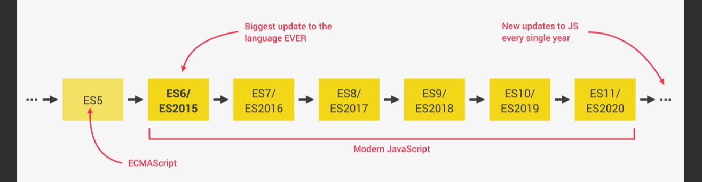

+ **javascript** is a high level, objct-oriented, multi-praradigm programming languges
  + high level: we dont need to worry about complex stuff like memory management
  + object-oriented: based on objectsfor storing most kinds of data
  + programing language: needs a computer to do things
  + multi-paradigm: we can use different styles of programming

####javaScript Releases


+ how to add link JS to HTML
```
    <body>
        <h1>JavaScript Fundamentals – Part 1</h1>
        <script src="script.js"></script>
    </body>
```

+ Values and variablees
  + Values: peice of information