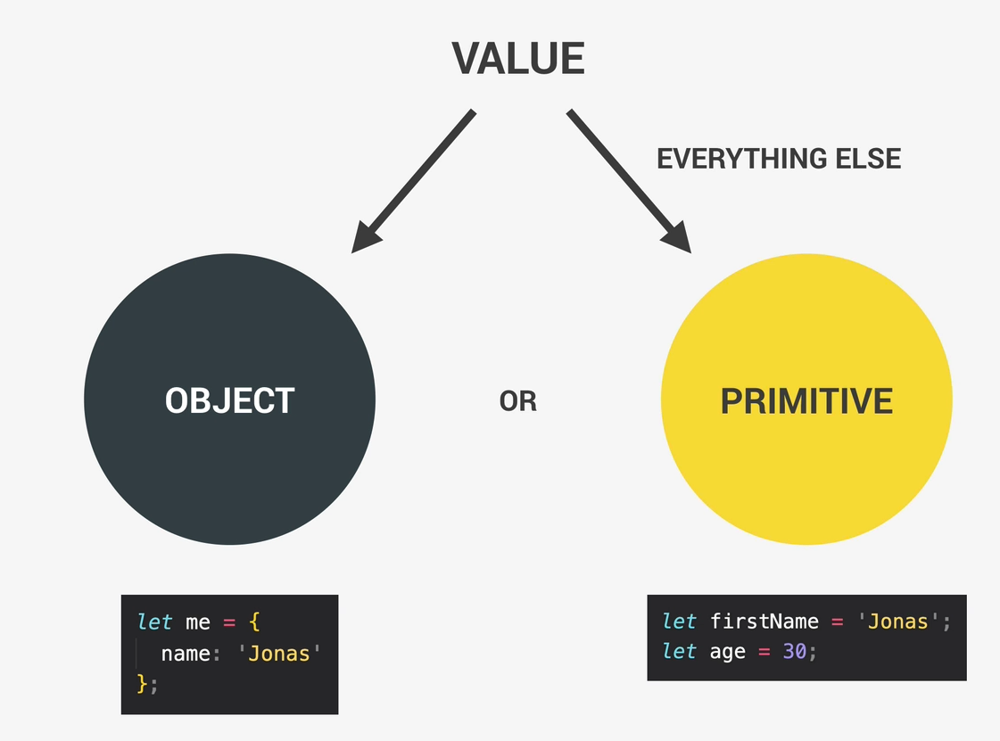
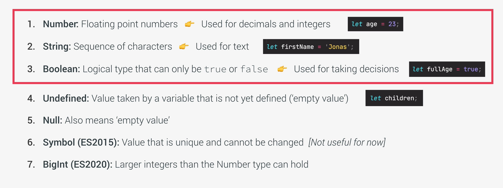

+ **javascript** is a high level, objct-oriented, multi-praradigm programming languges
  + high level: we dont need to worry about complex stuff like memory management
  + object-oriented: based on objectsfor storing most kinds of data
  + programing language: needs a computer to do things
  + multi-paradigm: we can use different styles of programming

####javaScript Releases


+ how to add link JS to HTML
```
    <body>
        <h1>JavaScript Fundamentals – Part 1</h1>
        <script src="script.js"></script>
    </body>
```

+ **Values and variablees**
  + Values: peice of information
  + Rules: variable names cannot start with a number.
  + Rules: variables can only contains: numbers, letters, $, _. Following is not accepted  ``` let jonas&Matila = "JM"```
  + Rules: variables with all letters uppercase are reserved for constants    ```let PI= 3.14```
  + Rules: Variables should be descriptive.  ```let myFirstJob = 'programmer';```

+ **Data Types**
  + values are either objects or Primitive data types
  
  

+ **The 7 Primitive Data Types**



+ **let, const, var**
  + const is immutable. 
  + we are not allowed to declare emply const variables
  + as a good practice, by default use ***const*** and use ***let*** when you are sure that you will assign a value to it later.
  + ***var*** is an old way. pretty much same as let


+ **Basic Operations**
  + Aritthmatic Operators: ***( - * / ** + )***
    + ***2 ** 3*** means 2 to the power of 3
  + ***+*** is also used for concatenations
  + ***typeof*** operator give type of a value. ``` console.log(typeof firstName)```
  + Assignment Operator: ***=***
    + ``x += 10   // x= x + 10`` 
    + ``x++  // x= x + 1`` 
  + Comparison Operators:  >, <, >=, <= 